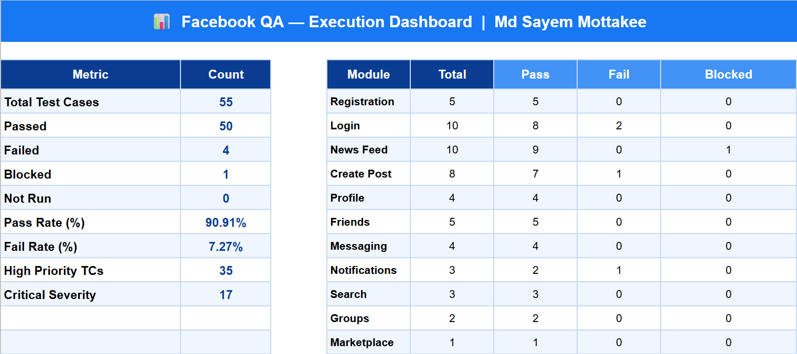

# 📘 QA Test Management & Jira Zephyr Execution Demo

## 📌 Overview

This project demonstrates a complete **QA Test Management lifecycle** including:

* Test Case Design
* Test Execution
* Defect Tracking
* Test Cycle Management
* Reporting & Dashboard Analysis
* Jira + Zephyr integration workflow

The project is built using:
* **Jira** – Issue & project tracking system  
* **Zephyr Scale** – Test management plugin for Jira  

---

## 🧪 Test Suite Scope

The test cases are designed for Facebook-like application functionalities:

* Registration
* Login
* News Feed
* Create Post
* Profile Management
* Friends System
* Messaging
* Notifications
* Search
* Groups
* Marketplace

---

## 📊 Test Execution Summary

* **Total Test Cases:** 55
* **Passed:** 50
* **Failed:** 4
* **Blocked:** 1

### 📈 Overall Result
* **Pass Rate:** 90.91%
* **Fail Rate:** 7.27%

---

## 📊 Module-wise Execution Summary

---

## 🧪 Sample Test Case Format

Each test case follows a standard QA structure:

| Field | Description |
| :--- | :--- |
| **TC ID** | Unique test case ID |
| **Name** | Test case title |
| **Module** | Functional area |
| **Priority** | High / Medium / Low |
| **Severity** | Critical / Major / Minor |
| **Preconditions** | Setup requirements |
| **Test Steps** | Step-by-step actions |
| **Test Data** | Input values |
| **Expected Result** | Expected system behavior |
| **Actual Result** | Observed behavior |
| **Status** | Pass / Fail / Blocked |

---

## 📌 Example Test Case

### TC_001 – Register with valid email

* **Module:** Registration  
* **Priority:** High  
* **Severity:** Critical  

**Preconditions:**
* Browser open
* Email not previously registered
* Internet connected

**Test Steps:**
1.  Go to facebook.com  
2.  Click "Create New Account"  
3.  Fill valid user details  
4.  Click Sign Up  

**Test Data:**
* **Name:** Md Sayem Mottakee  
* **Email:** sayemmottakee2000@gmail.com  
* **DOB:** 01/Jan/1995  
* **Password:** Test@1234!

**Expected Result:**
* Account should be created successfully
* User should be redirected to confirmation screen

**Status:** ✅ Pass  

---

## 🔁 Jira Zephyr Workflow

The following workflow was followed:

### 1. Test Case Creation
* Created in Zephyr Scale inside Jira.
* Structured with: Summary, Preconditions, Steps, Expected Results.

### 2. Test Cycle Creation
* Grouped into: Smoke Testing, Regression Testing, Functional Testing.

### 3. Test Execution
* Executed inside Zephyr cycles.
* Status updated: Pass, Fail, Blocked.

### 4. Defect Tracking
* Failed cases linked with Jira defects.
* Example: `FB-2201` → Account lockout issue.

### 5. Reporting
* Generated execution reports: Cycle Summary Report, Traceability Report, Defect Report.

---

## 📁 Zephyr Field Mapping (CSV Import)

| CSV Field | Zephyr Field |
| :--- | :--- |
| **Summary** | Name |
| **Precondition** | Precondition |
| **Priority** | Priority |
| **Test Step** | Test Script (Steps) |
| **Test Data** | Test Script (Test Data) |
| **Expected Result** | Test Script (Expected Result) |

---

## 📌 Example Jira Test Case Execution

**Test Case ID:** QAD-T34  
**Title:** Accept Friend Request  

* **Objective:** Verify user can accept friend request.  
* **Precondition:** Pending friend request exists.  
* **Status:** Executed  

.png)

---

## 🚀 Skills Demonstrated

* Manual Test Case Design  
* Test Planning & Execution  
* Defect Lifecycle Management  
* Jira Workflow Understanding  
* Zephyr Scale Usage  
* CSV Import & Field Mapping  
* QA Reporting & Dashboard Analysis  

---

## 📌 Conclusion

This project demonstrates a complete **real-world QA workflow** using industry tools like Jira and Zephyr. 

It shows strong capability in:
✔ Test Design  
✔ Execution Tracking  
✔ Defect Management  
✔ Reporting & Analysis  
✔ Agile QA Process Understanding
